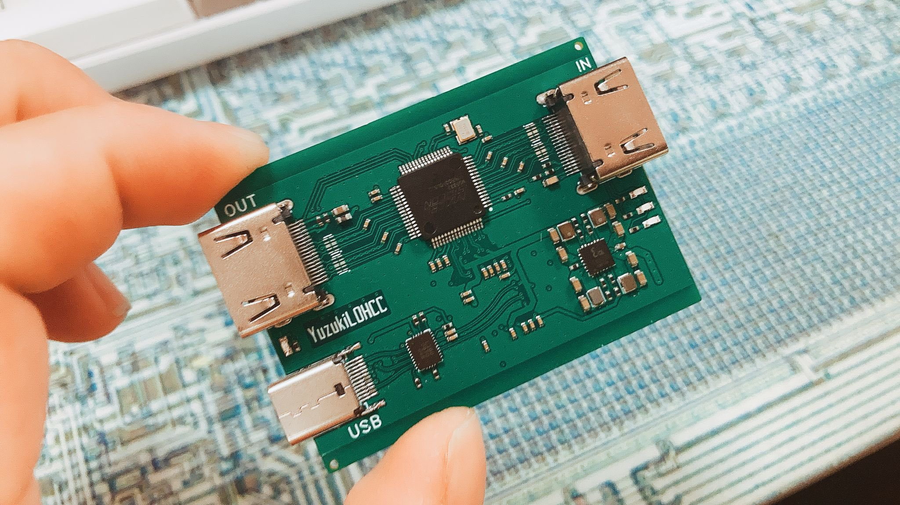
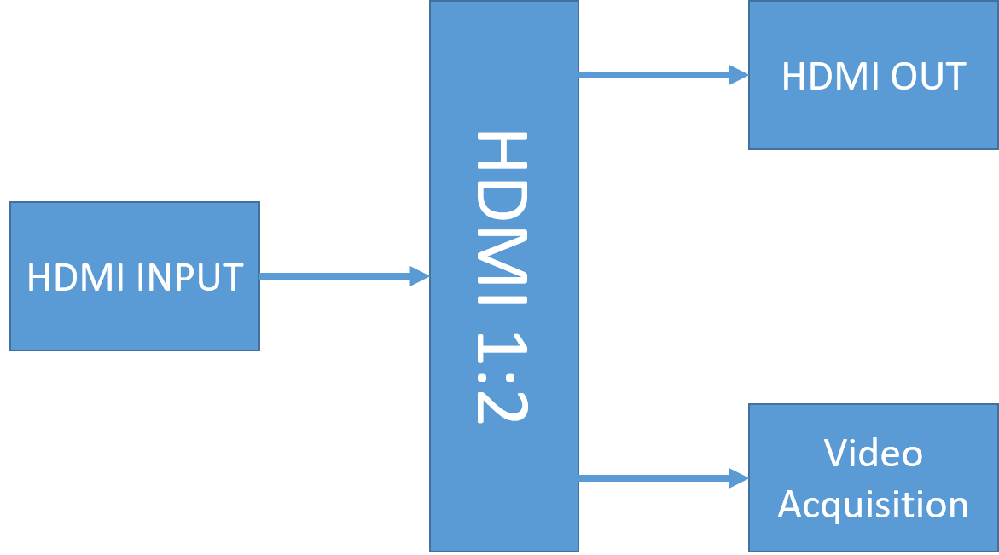
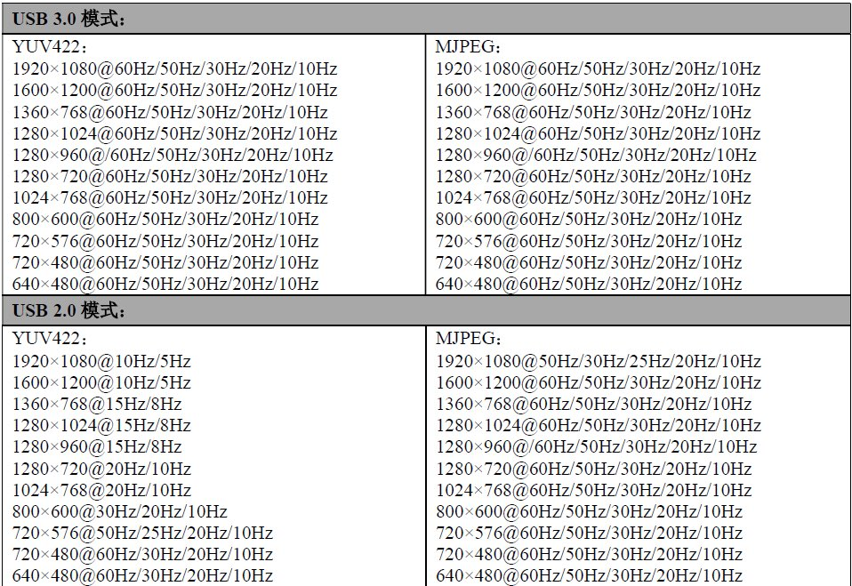
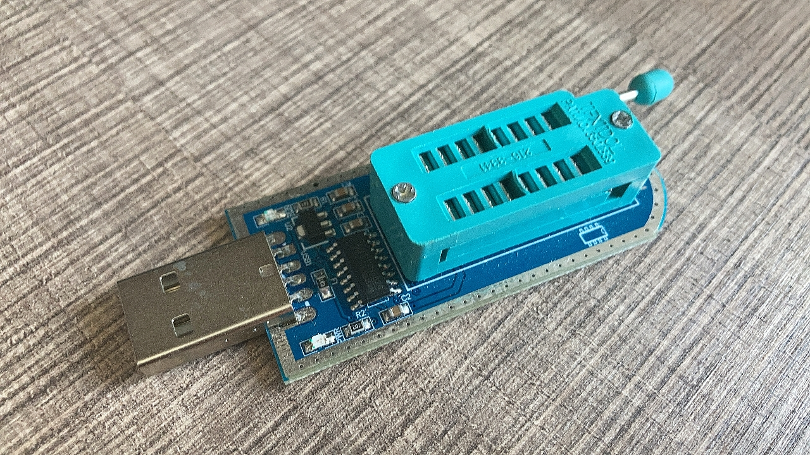

# YuzukiLOHCC PRO

Yuzuki **L**oop **O**ut **H**DMI **C**apture **C**ard PRO

**CERN Open Hardware Licence Version 2 - Permissive**

Low cost USB3.2Gen1 HDMI-USB Video Acquisition With Loop Out (Loop Out HDMI Capture Card)

## About

Ultra low cost Loop Out HDMI-USB Video Acquisition (HDMI Capture Card) based on MS2130 and MS9332 + MS8003

MS2130 is a USB 3.2 Gen 1 high-definition video and audio acquisition chip, which is internally integrated with USB 3.2 Gen 1 Device controller, data transceiver module, and audio and video processing module. The MS2130 can transmit the audio and video signals input by HDMI to a PC, smartphone, or tablet for preview or collection through the USB 3.2 Gen 1 interface. The MS2130 output supports YUV422 and MJPEG modes, and is compatible with Windows, Linux, Android and Mac OS systems. Support OBS Studio, Camera, and FFmpeg.

- Support HDMI 4Kx2K@30Hz and HDMI 2.0, YCbCr420 4Kx2K@60Hz Loop Out
- Support 10/12/16 bit Deep Color for Loop Out
- Adaptive input equalization for Loop Out
- Integrated pre-programmed HDCP keys for Loop Out
- Embedded EDID RAM for Loop Out
- USB Type-C USB3.2 Gen 1 interface
- Full height HDMI x 2
- Compatible with DVI 1.0
- Support YUV&JPEG output
- Compatible with UVC 1.0, UAC 1.0
- Support audio capture
- Support video capture
- Maximum video input 3840x2160@30
- The highest output resolution is 4096x2160@15
- Support 1920x1080@60
- Support Windows 7 Above, macOS 10 and later, Linux, Android and so on
- Standed UVC 1.0, Support OBS Studio, Camera, FFmpeg and so on.

## Basic 

### Supported USB output resolution table

## Flash Firmware

Use an SPI NOR flasher to flash the firmware to the NOR Flash before soldering.

(Only one SPi NOR of `U4` or `U8` needs to be mounted, adding two pads are drawn to be compatible with different types of materials)

**Unfortunately, I couldn't find a public version of the MS8003 code, but it's not expensive to buy a pre-programmed set**

## Links

OSHWHub OpenSource (Chinese): [https://oshwhub.com/gloomyghost/yuzuki-lohcc-pro-usb-3-2-gen1-hdmi-huan-chu-cai-ji-ka](https://oshwhub.com/gloomyghost/yuzuki-lohcc-pro-usb-3-2-gen1-hdmi-huan-chu-cai-ji-ka)

